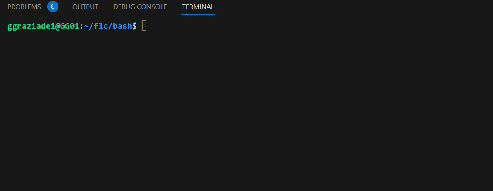
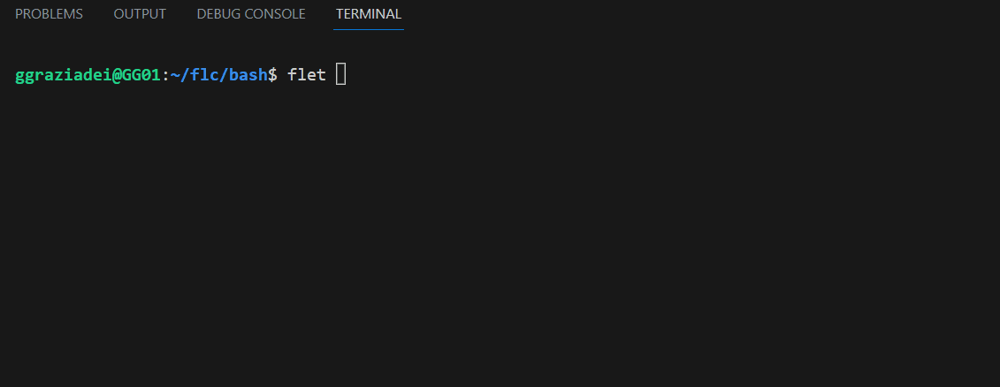
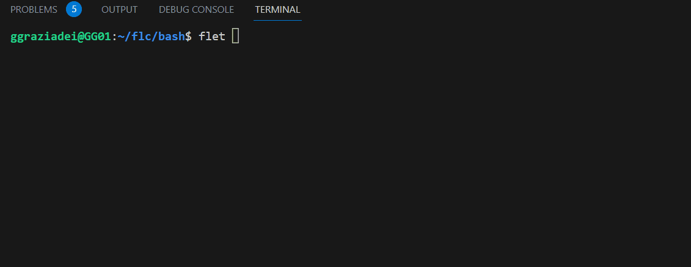

# FLET - c lib 
Evaluate arithmetic floating point expressions. This library is oriented to work with Bash.

- [Authors](#authors)
- [License](#license)
- [Options](#options)
- [Grammar](#grammar)
- [Variable as operand](#variable-as-operand)
- [Install](#install)
- [Test](#test)
- [Exit Status](#exit-status)

## Authors 
This work is produced for academic purpose at the Politecnico di Torino.

Course website: <https://www.skenz.it/compilers>

Gianluca Graziadei: <gianluca.graziadei@studenti.polito.it>

Prof. Stefano Scanzio: <stefano.scanzio@polito.it>

## License
<http://www.gnu.org/licenses/>

## Options

    -f	declare input from file PATH
    -d	enable DEBUG (bison debugger)

## Grammar 

Evaluate each ARG as an arithmetic expression. Each expression ends with semicolumn. The following list of operators is
grouped into levels of equal-precedence operators.  The levels are listed
in order of decreasing precedence.

	id++, id--	variable post-increment, post-decrement
	++id, --id	variable pre-increment, pre-decrement
	-, +		unary minus, plus
	!, ~		logical and bitwise negation
	**			exponentiation
	*, /, %		multiplication, division, remainder
	+, -		addition, subtraction
	<<, >>		left and right bitwise shifts
	<=, >=, <, >	comparison
	==, !=		equality, inequality
	&		bitwise AND
	^		bitwise XOR
	|		bitwise OR
	&&		logical AND
	||		logical OR
	boolean_exp ? scalar_exp : scalar_exp conditional operator
	=, *=, /=, %=,
	+=, -=, <<=, >>=,
	&=, ^=, |=	assignment
	id=scalar_exp|boolean_exp
	acos(scalar_exp) computes arc cosine. 
	acosh(scalar_exp) computes arc hyperbolic cosine. 
	asin(scalar_exp) computes arc sine. 
	asinh(scalar_exp) computes the hyperbolic of arc sine of an argument. 
	atan(scalar_exp) computes the arc tangent of an argument. 
	atan2(scalar_exp) computes the arc tangent of an argument. 
	atanh(scalar_exp) computes arc hyperbolic tangent. 
	cbrt(scalar_exp) computes cube root of a number.
	ceil(scalar_exp) computes the nearest integer greater than argument. 
	cos(scalar_exp) computes the cosine of an argument. 
	cosh(scalar_exp) computer hyperbolic cosine. 
	exp(scalar_exp) computes the exponential raised to the argument. 
	fabs(scalar_exp) computes absolute value. 
	floor(scalar_exp) calculates the nearest integer less than argument. 
	hypot(scalar_exp) computes hypotenuse. 
	log(scalar_exp) computes natural logarithm of an argument. 
	log10(scalar_exp) computes the base 10 logarithm of an argument. 
	pow(scalar_exp) Computes power of a number. 
	sin(scalar_exp) compute sine of a number.
	sinh(scalar_exp) computes the hyperbolic sine of an argument.
	sqrt(scalar_exp) computes square root of a number. 
	tan(scalar_exp) computes tangent. 
	tanh(scalar_exp) computes the hyperbolic tangent of an argument.

## Variable as operand

Shell variables are allowed as operands.  The name of the variable
is replaced by its value (coerced to a fixed-width integer) within
an expression.  The variable need not have its integer attribute
turned on to be used in an expression.

Operators are evaluated in order of precedence.  Sub-expressions in
parentheses are evaluated first and may override the precedence
rules above.

## Install
Generate the static library lib_flet.a

    make

## Test
In the /test folder there are tests that cover the gramamr rules.
Run the test executable with:

    make test
    ./test "my_exp"

## Exit Status

If the last ARG evaluates to 0, flet returns 1; flet returns 0 otherwise.
